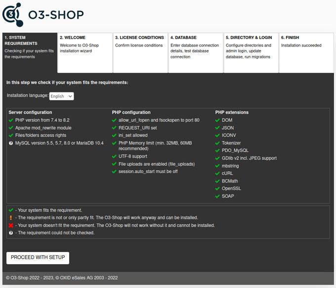

# New Installation

## Create database

O3-Shop requires a MySQL or MariaDB database to store items, categories, customer and order data and other information.

Most web hosts offer database access via a web-based application, as e.g. phpMyAdmin. If you need help with this, please contact your hosting partner or Internet Service Provider (ISP).

Create a new database. You can choose the name of the database freely, for example `o3_shop`.

## Provide shop files

The shop files are provided by Composer. The shop files are stored in a subdirectory that is specified in the command with **your_project_name**. This is based on the directory in which the command is issued in the terminal window. The parameter **--no-dev** is specified if the development-related files are not needed.

Open a terminal window and navigate to the main store directory.

Install the shop executing the Composer command:

```
composer create-project --no-dev o3-shop/o3-shop your_project_name ^1.4
```

```{note}
Use a different version constraint to install a different project version.

- `^1.4` for the latest official release of the 1.4.x branch
- leave empty for the latest official release
```

After Composer has finished its work, the new directory named *your_project_name* exists. This is the root directory of the project and contains all files needed for the installation of the O3-Shop.

## Adjust file and directory permissions

The HTTP server requires read and write access for the following directories and their subdirectories at runtime:

- `/source/export`
- `/source/log/`
- `/source/out/pictures/`
- `/source/out/media/`
- `/source/tmp/`
- `/var/`

In addition, the CLI user (Command Line Interface) also needs read and write access for the directory `/var/`.

For the web-based setup, the HTTP server must have write access to the following directory and these files:

- `/source/Setup`
- `/source/config.inc.php`
- `/.env`
- `/source/.htaccess`

## Configure Apache

The root directory must point to a directory that the HTTP server can access. The document root directory of Apache must point to the ***/source*** directory of the main directory.

If you are able to run the setup application as described in the next paragraph this configuration was successful.

## Run web-based setup application

Open a browser and go to `www.yourshopurl.com/setup`.

Replace `www.yourshopurl.com` with the URL where your O3-Shop will be accessible.



### System Requirements

Colored symbols indicate whether the system requirements are met:<br>
 The prerequisite is fulfilled.<br>
 The prerequisite is not completely fulfilled, tough the shop can be installed.<br>
 The prerequisite is not fulfilled, the shop can't be installed.<br>
 The prerequisite could not be checked.

- Select the language for the installation. This selection only has influence on the language of the setup application, not on the shop installation itself.
- Make sure that all system requirements are fulfilled in order to install the O3-Shop and operate without issues. In case of configuration problems, contact your hosting partner or Internet Service Provider (ISP).

### Welcome

Set the main delivery country and the shop language. You can add more delivery countries and/or languages after installation in the shop admin.

### Licence conditions

Check the licence conditions and accept as requisite to install the shop.

### Database

Create a database or integrate an existing database.

**Database server hostname or IP address**

- If the database and web server are on the same server, leave the default value localhost. This is the default for most shops.
- If your database is outsourced, enter the host name or IP address of your database server. If you need to specify a port, it is placed after the host name and a colon (host name:port).

**Database server TCP Port**

The TCP port, usually 3306.

**Database name**

Enter the name of the shop's database.

**Database user ame** and **database password**

Enter the access data for the database.

**Demodata**

Decide whether you want to install the shop pre-configured with sample items.

Demodata is recommended if you want to familiarise yourself with the shop in a test installation first.

You can delete the demodata at any time if you want to fill the shop with your own articles.

If you specified a none-empty database, you will be asked if setup should continue and all previous data will be erased.

### Directory & Login

If necessary, the directory settings can be adjusted:

**Shop URL**:
The URL your eShop will be accessible.

**Directory for O3-Shop**:
The internal path of the shop on the server (e.g. /var/www/your_project_name/source/).

**Directory for temporary data**:
The internal path for the shop's temporary files, e.g. for Smarty or SEO cache.


Provide the admin user login data for the shop's administration area.

**Administrator email** and **Administrator password**:
Enter the administrator's email address and password. Use this data to log in to the administration area after the setup.

## Complete installation

### Setup directory

After successful installation, the **/setup** directory is automatically deleted. This is to prevent the setup from being called up again at a later time. Check whether the deletion of the directory was successful.

Also verify that the files config.inc.php and .inv in the shop's source directory are set to read-only. If not execute:

```{note}
chmod 0444 config.inc.php

chmod 0444 .env
```

