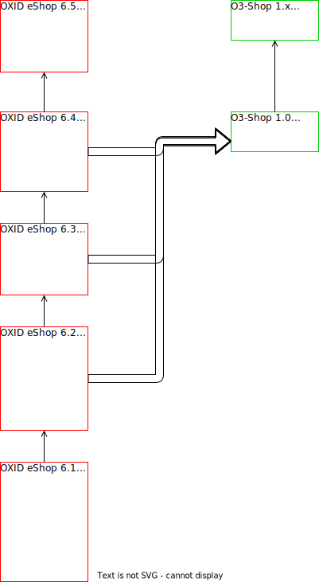

# Requirements for a migration

Please ensure that *all* requirements are met beforehand:

- an error-free Composer installation of the OXID eShop
- OXID eShop in version 6.2, 6.3 or 6.4
  For older shop versions, please carry out the update offered by OXID eSales to the named shop version beforehand. Newer OXID shops (> 6.4.3) cannot be migrated.
- OXID eShop Community Edition, Professional Edition or Enterprise Edition
  All editions of the OXID shop can be migrated. Please note that not all features of the Enterprise Edition are available in the O3-Shop.
- The OXID eShop was installed via the package `oxid-esales/oxideshop-project`.
  Check if `oxid-esales/oxideshop-project` is mentioned as `name` in the file `composer.json` in the main directory of your shop. If you use a different package composition, please check its components manually to see if they can be replaced.

Available migration paths:

